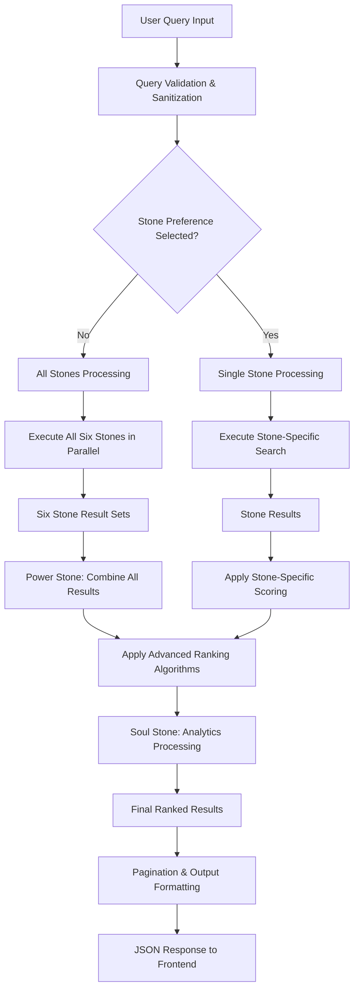
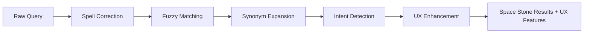
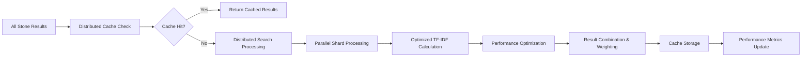
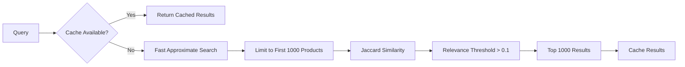
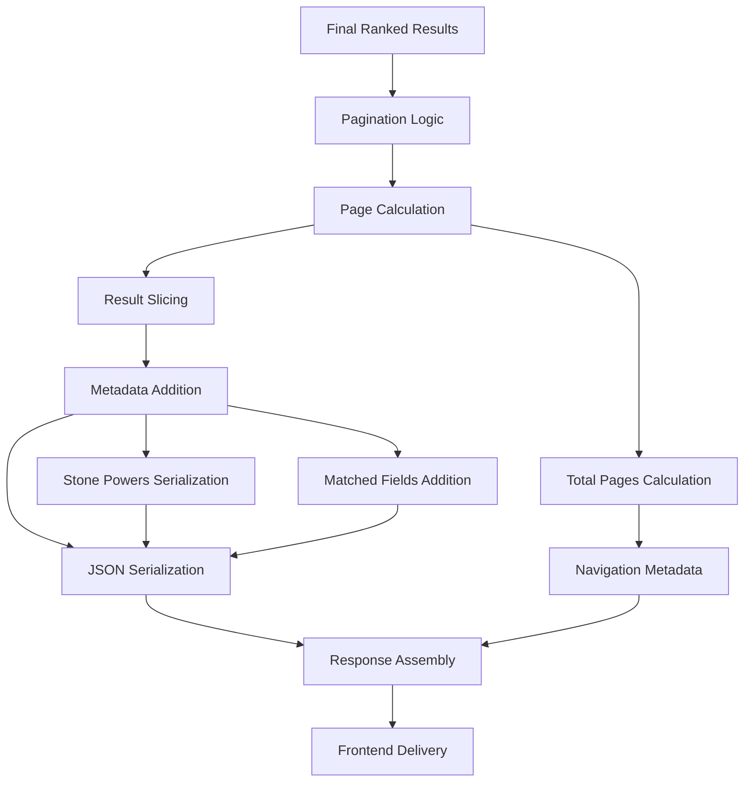
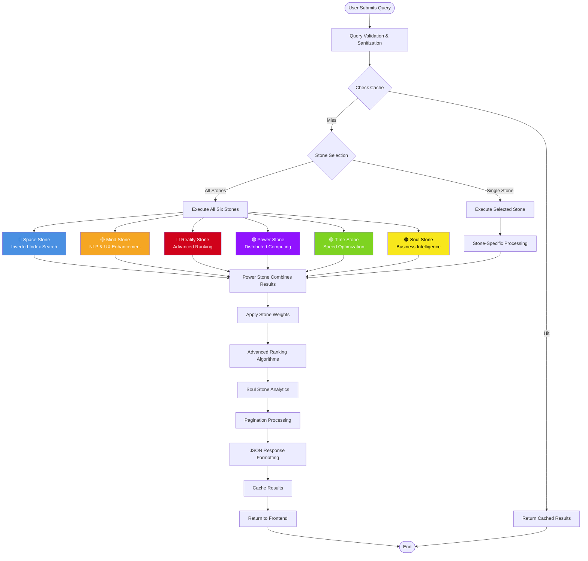
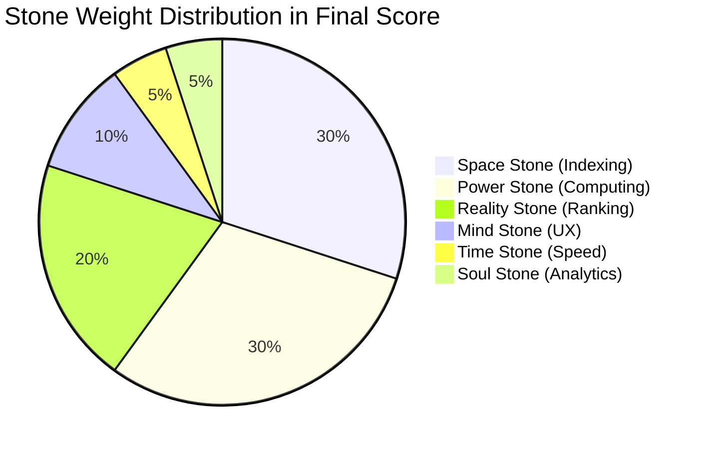
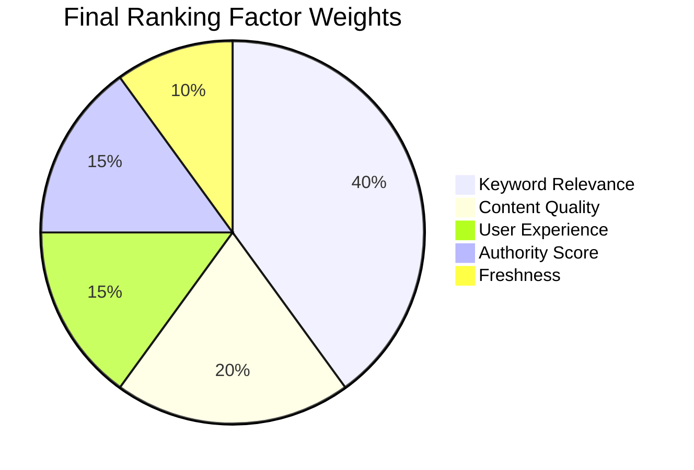

# Infinity Stones Search Engine - Query Processing Workflow

## Overview
This document provides a comprehensive flowchart and explanation of how queries are processed in the Infinity Stones Search Engine, including weight assignments, scoring mechanisms, and final output generation.

## Table of Contents
- [System Architecture](#system-architecture)
- [Query Processing Pipeline](#query-processing-pipeline)
- [Stone-Specific Processing](#stone-specific-processing)
- [Weight Assignment System](#weight-assignment-system)
- [Scoring & Ranking Algorithms](#scoring--ranking-algorithms)
- [Final Output Generation](#final-output-generation)
- [Flowchart Diagrams](#flowchart-diagrams)

---

## System Architecture

The Infinity Stones Search Engine is built on the fundamental search engine principles:
1. **Crawling** - Data discovery and collection
2. **Indexing** - Content organization and cataloging
3. **Ranking** - Relevance scoring and result ordering

Each of the six Infinity Stones represents a different aspect of search functionality:

| Stone | Color | Function | Search Engine Aspect |
|-------|-------|----------|----------------------|
| 🔵 Space | Blue | Data Exploration | Inverted indexing, distributed search |
| 🟡 Mind | Yellow | Query Understanding | NLP, synonyms, spell correction |
| 🔴 Reality | Red | Relevance & Ranking | TF-IDF, BM25, personalization |
| 🟣 Power | Purple | Computational Power | Performance optimization, caching |
| 🟢 Time | Green | Algorithm Selection | Query optimization, caching |
| 🟠 Soul | Orange | Business Intelligence | Analytics, user behavior tracking |

---

## Query Processing Pipeline



---

## Stone-Specific Processing

### 🔵 Space Stone (Data Exploration)
**Weight in Final Score: 30%**


**Processing Steps:**
1. **Query Tokenization**: Split query into individual words
2. **Index Lookup**: Search inverted index for each word
3. **Shard Processing**: Distribute search across data shards
4. **Score Calculation**: Simple word match frequency
5. **Metadata**: Add shard information for distributed processing

**Scoring Formula:**
```
Space_Score = Word_Matches / Total_Words_in_Product
```

### 🟡 Mind Stone (Query Understanding)
**Weight in Final Score: 10%**



**Processing Steps:**
1. **Spell Correction**: Fix common misspellings
2. **Fuzzy Matching**: Find similar terms with high confidence (>0.8)
3. **Query Expansion**: Add synonyms to broaden search
4. **Intent Detection**: Analyze query patterns (comparison, specs, price, etc.)
5. **UX Enhancement**: Add highlighting, snippets, facets
6. **Intent Boosting**: Boost scores based on detected intent

**Intent-Based Score Boosts:**
- **Comparison Intent**: +0.1 for detailed specifications
- **Specification Intent**: +0.02 per technical term (max +0.1)
- **Brand Intent**: +0.05 for clear brand information

### 🔴 Reality Stone (Advanced Ranking)
**Weight in Final Score: 20%**


**Processing Steps:**
1. **TF-IDF Scoring**: Term frequency × Inverse document frequency
2. **BM25 Scoring**: Advanced probabilistic ranking function
3. **Embedding Similarity**: Semantic similarity (simulated with Jaccard)
4. **Personalization**: User preference boosts
5. **Business Logic**: Promoted brands/categories
6. **Diversity**: Ensure variety in results

**Combined Ranking Formula:**
```
Reality_Score = (TF-IDF × 0.4) + (BM25 × 0.4) + (Embedding × 0.2)
+ Personalization_Boost + Business_Boost
```

**TF-IDF Calculation:**
```
TF = (Word_Count_in_Document / Total_Words_in_Document)
IDF = log(Total_Documents / Documents_Containing_Word)
TF-IDF = TF × IDF
```

**BM25 Calculation:**
```
BM25 = IDF × (tf × (k1 + 1)) / (tf + k1 × (1 - b + b × (doc_length / avg_doc_length)))
Where: k1 = 1.2, b = 0.75
```

### 🟣 Power Stone (Computational Power)
**Weight in Final Score: 30%**



**Processing Steps:**
1. **Cache Check**: Look for cached results first
2. **Distributed Processing**: Simulate parallel shard processing
3. **Optimized Scoring**: Fast TF-IDF with caching
4. **Performance Limits**: Early termination for large result sets (>2000)
5. **Result Combination**: Weighted combination of all stone results
6. **Caching**: Store results for future queries

**Stone Weight Distribution:**
```python
stone_weights = {
    StoneType.SPACE: 0.3,    # 30% - Core indexing
    StoneType.MIND: 0.1,     # 10% - UX and understanding
    StoneType.REALITY: 0.2,  # 20% - Advanced ranking
    StoneType.POWER: 0.3,    # 30% - Computational optimization
    StoneType.TIME: 0.05,    # 5% - Speed optimization
    StoneType.SOUL: 0.05     # 5% - Analytics insights
}
```

**Final Score Combination:**
```
Final_Score = Σ(Stone_Score × Stone_Weight) for all active stones
```

### 🟢 Time Stone (Speed Optimization)
**Weight in Final Score: 5%**



**Processing Steps:**
1. **Cache First**: Check for existing cached results
2. **Fast Search**: Limit to first 1000 products for speed
3. **Jaccard Similarity**: Quick intersection/union calculation
4. **Threshold Filter**: Only include results with >10% similarity
5. **Result Limit**: Return top 1000 results maximum
6. **Caching**: Store for future quick retrieval

**Jaccard Similarity Formula:**
```
Jaccard = |Query_Words ∩ Product_Words| / |Query_Words ∪ Product_Words|
```

### 🟠 Soul Stone (Business Intelligence)
**Weight in Final Score: 5%**


**Processing Steps:**
1. **Business Scoring**: Rate products based on business criteria
2. **Analytics Tracking**: Record search patterns and popular queries
3. **Category Trends**: Track product category popularity
4. **Brand Analysis**: Monitor brand search frequency
5. **User Behavior**: Collect interaction patterns

**Business Score Calculation:**
```
Business_Score = Brand_Score(0.3) + Type_Score(0.2) + Description_Score(0.1)
Max_Score = 1.0
```

---

## Weight Assignment System

### Primary Weight Distribution
The system uses a hierarchical weighting approach:

1. **Stone-Level Weights** (Combine different search approaches):
   - Space Stone: 30% - Core search functionality
   - Power Stone: 30% - Computational optimization
   - Reality Stone: 20% - Advanced ranking
   - Mind Stone: 10% - User experience
   - Time Stone: 5% - Performance optimization
   - Soul Stone: 5% - Business intelligence

2. **Algorithm-Level Weights** (Within each stone):
   - Reality Stone uses multiple algorithms with internal weights:
     - TF-IDF: 40%
     - BM25: 40% 
     - Embedding Similarity: 20%

3. **Factor-Level Weights** (Final ranking factors):
   - Keyword Relevance: 40%
   - Content Quality: 20%
   - User Experience: 15%
   - Authority Score: 15%
   - Freshness: 10%

### Dynamic Weight Adjustment
Weights can be adjusted based on:
- **Query Type**: Technical queries boost Reality Stone weight
- **User Behavior**: Frequent users get more personalization
- **Business Rules**: Promotional periods adjust business weights
- **Performance**: Slow queries increase Time Stone influence

---

## Scoring & Ranking Algorithms

### Multi-Level Scoring System

#### Level 1: Stone-Specific Scoring
Each stone calculates its own relevance score using different methodologies:

```python
# Pseudo-code for scoring process
def calculate_stone_scores(query, products):
    stone_scores = {}
    
    for stone_type in active_stones:
        stone_results = stone.search(query)
        stone_scores[stone_type] = []
        
        for result in stone_results:
            score = stone.calculate_relevance(query, result.product_data)
            stone_scores[stone_type].append((result.product_id, score))
    
    return stone_scores
```

#### Level 2: Combined Scoring
The Power Stone combines all individual stone scores:

```python
def combine_stone_scores(stone_scores, stone_weights):
    combined_scores = defaultdict(float)
    
    for stone_type, results in stone_scores.items():
        weight = stone_weights[stone_type]
        
        for product_id, score in results:
            combined_scores[product_id] += score * weight
    
    return combined_scores
```

#### Level 3: Advanced Ranking
Additional ranking factors are applied to the combined scores:

```python
def apply_advanced_ranking(combined_scores, query, products):
    final_scores = {}
    
    for product_id, base_score in combined_scores.items():
        product = get_product(product_id)
        
        # Apply ranking factors
        keyword_score = calculate_keyword_relevance(query, product)
        content_quality = calculate_content_quality(product)
        ux_score = get_ux_score(product_id)
        authority_score = get_authority_score(product_id)
        freshness_score = get_freshness_score(product_id)
        
        final_score = (
            keyword_score * 0.4 +
            content_quality * 0.2 +
            ux_score * 0.15 +
            authority_score * 0.15 +
            freshness_score * 0.1
        )
        
        final_scores[product_id] = final_score
    
    return final_scores
```

### Authority Score Calculation
Based on product quality indicators (similar to PageRank):

```python
def calculate_authority_score(product):
    score = 0.0
    
    # Brand authority (well-known brands)
    if brand in premium_brands:
        score += 0.4
    elif brand in popular_brands:
        score += 0.3
    else:
        score += 0.2
    
    # Information completeness
    required_fields = ['Name', 'Type', 'Brand', 'Sales Package']
    completeness = sum(1 for field in required_fields if field in product)
    score += (completeness / len(required_fields)) * 0.3
    
    # Description quality
    if len(product.get('Sales Package', '')) > 100:
        score += 0.2
    
    return min(score, 1.0)
```

### Freshness Score Calculation
Estimates content recency:

```python
def calculate_freshness_score(product):
    score = 0.5  # Base score
    
    # Product ID length heuristic (newer products might have longer IDs)
    if len(product['id']) > 10:
        score += 0.2
    elif len(product['id']) > 5:
        score += 0.1
    
    # Detailed information indicates recent updates
    if len(product.get('Sales Package', '')) > 200:
        score += 0.2
    
    return min(score, 1.0)
```

---

## Final Output Generation

### Result Processing Pipeline



### Response Structure
```json
{
  "success": true,
  "query": "user search query",
  "stone_used": "all|specific_stone",
  "results": [
    {
      "product_id": "unique_identifier",
      "product_data": {
        "Brand": "Product Brand",
        "Type": "Product Type",
        "Model Number": "Model",
        "Sales Package": "Description",
        "_shard_id": 1,
        "_highlighted": {...},
        "_snippet": "Generated snippet",
        "_facets": {...}
      },
      "relevance_score": 0.95,
      "stone_powers": {
        "Space Stone": 0.8,
        "Mind Stone": 0.7,
        "Reality Stone": 0.9,
        "Power Stone": 0.85,
        "Time Stone": 0.6,
        "Soul Stone": 0.75
      },
      "matched_fields": ["brand", "type", "features"]
    }
  ],
  "pagination": {
    "page": 1,
    "per_page": 25,
    "total_results": 150,
    "total_pages": 6,
    "has_next": true,
    "has_prev": false,
    "next_page": 2,
    "prev_page": null
  },
  "search_time": 0.234,
  "timestamp": 1694123456.789
}
```

### Performance Metrics
The system tracks and reports various performance metrics:

- **Query Processing Time**: End-to-end search duration
- **Cache Hit Ratio**: Percentage of queries served from cache
- **Throughput**: Queries per second capability
- **Stone Performance**: Individual stone processing times
- **Result Quality**: User interaction and satisfaction metrics

---

## Flowchart Diagrams

### Complete Query Processing Flow



### Stone Weight Distribution Visualization



### Ranking Factor Weights



---

## Performance Characteristics

### Scalability Metrics
- **Maximum Results**: 2000 per query (Power Stone limit)
- **Pagination**: 25 results per page (configurable 1-100)
- **Cache Capacity**: LRU cache with configurable size
- **Shard Distribution**: Up to 10 shards for distributed processing
- **Query Throughput**: Target 1000 QPS with <200ms latency

### Quality Assurance
- **Relevance Validation**: Multi-algorithm scoring ensures quality
- **Diversity Enforcement**: Prevents over-representation of single brands/categories
- **Business Logic**: Promotional and strategic result boosting
- **User Personalization**: Adaptive scoring based on user preferences
- **Analytics Feedback**: Continuous improvement through usage analytics

---

## Conclusion

The Infinity Stones Search Engine implements a sophisticated multi-layered approach to query processing, combining traditional search algorithms with modern techniques like distributed computing, caching, and business intelligence. The weighted combination of six specialized "stones" ensures comprehensive coverage of all search aspects while maintaining high performance and relevance.

The system is designed to be:
- **Scalable**: Distributed processing across shards
- **Fast**: Multi-level caching and optimization
- **Accurate**: Multiple ranking algorithms and quality factors  
- **User-Friendly**: NLP processing and UX enhancements
- **Business-Aware**: Analytics and promotional logic
- **Maintainable**: Modular stone-based architecture

This workflow ensures that every query receives the full power of all six Infinity Stones, delivering the most relevant and useful results to users while maintaining exceptional performance characteristics.
